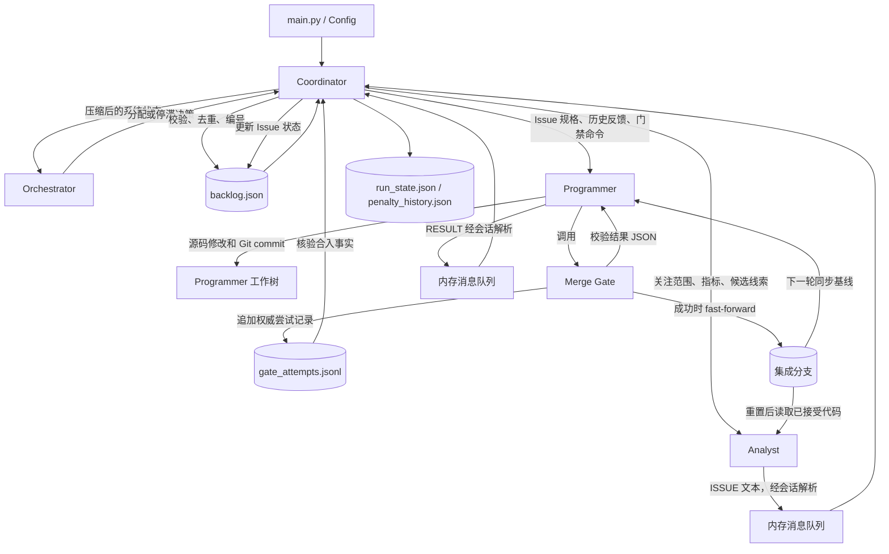

# 系统文件流与 Agent 输入输出关系

本文档描述 `experiment_token_save` 当前实现中的运行时数据流，重点回答四个问题：每个 Agent 从哪里取得输入、实际接收什么、产生什么输出，以及输出最终交给谁。这里的“文件流”不仅包括磁盘文件，也包括进程内消息、子进程标准输出和 Git 分支，因为系统的最终状态由这几类载体共同构成。

## 1. 总体结构

系统以 `main.py` 为入口。入口解析命令行参数和环境配置，构造 `Config`，随后创建 `Coordinator` 并进入调度循环。`Coordinator` 是全局唯一的状态管理者：它创建 Agent 工作树、维护任务积压、调用 Orchestrator、启动 Analyst 和 Programmer，并接收它们的完成消息。

系统包含五种具有明确职责的执行角色：

| 角色 | 主要职责 | 是否直接修改源码 | 是否直接写任务积压 | 是否能够合入集成分支 |
|---|---|---:|---:|---:|
| Coordinator | 维护全局状态、调度 Agent、验证结果、持久化运行状态 | 否 | 是 | 间接，通过 Merge Gate |
| Orchestrator | 根据当前状态决定任务分配，并判断停滞 Agent 是否应终止 | 否 | 否 | 否 |
| Analyst | 检查已接受代码，发现需要重构的函数 | 否 | 否 | 否 |
| Programmer | 在隔离工作树中完成非功能性重构并提交候选修改 | 是，仅修改自己的工作树 | 否 | 不能直接合入 |
| Merge Gate | 验证候选提交并原子化推进集成分支 | 不生成重构代码 | 否 | 是 |

系统的核心控制关系如下：



## 2. 三类数据通道

理解系统流向时，必须区分以下三类通道。

### 2.1 进程内控制通道

Coordinator 直接调用 Orchestrator，并通过返回值获得分配决策。Analyst 和 Programmer 在独立线程及子进程中运行，它们的会话包装器将可解析结果转换为 `Message`，放入共享内存消息队列。Coordinator 是该队列的唯一消费者，也是 `backlog.json` 和 `run_state.json` 的唯一写入者。

内存消息负责快速协调，但不能单独证明一次代码合入已经发生。尤其是 Programmer 发出的 `MERGE_RESULT` 必须由 Coordinator 使用磁盘上的门禁记录再次核验。

### 2.2 持久化证据通道

运行目录 `results/<run-id>/` 保存可恢复状态和审计证据。最关键的持久化文件是：

- `backlog.json`：任务状态的权威存储；
- `run_state.json`：运行恢复所需的全局状态；
- `gate_attempts.jsonl`：Merge Gate 每次尝试的追加式记录，也是成功合入声明的权威证据；
- `issues/<issue-id>/history.jsonl`：某个 Issue 的跨尝试反馈；
- `logs/*.log`：Agent 子进程的原始流式输出。

### 2.3 Git 代码通道

每个 Programmer 都在独立 feature worktree 中修改源码。Analyst 使用独立的只读语义工作树检查当前已接受代码。所有被接受的修改汇集到本地集成分支 `refactor/<run-id>`。Merge Gate 是唯一被授权推进该分支的组件；Programmer 自己的提交只是候选结果，并不等于系统已经接受该修改。

## 3. Agent 输入输出总表

| Agent | 输入来源 | 实际输入内容 | 直接输出 | 输出接收方 | 持久化落点 |
|---|---|---|---|---|---|
| Orchestrator | Coordinator | 当前/基线罚分、指标分解、压缩任务视图、空闲 Agent、停滞计数 | Programmer/Analyst 分配决策；或终止/保留决策 | Coordinator，同步返回 | `orchestrator_raw_responses.jsonl`、`orchestrator_usage.jsonl` |
| Analyst | Coordinator、Analyst 工作树、提示词文件 | 关注指标或目录、罚分分解、启用指标、最多一页候选线索、当前已接受源码 | `ISSUE:` 行或 `NO_ISSUES`；完成状态 | AnalystSession 解析后写入消息队列，最终由 Coordinator 消费 | `logs/ANALYST_<n>_<dispatch>.log`；校验后的 Issue 由 Coordinator 写入 `backlog.json` |
| Programmer | Coordinator、Programmer 工作树、Issue 历史、提示词文件 | 1–2 个 Issue 规格、尝试次数、历史反馈、集成分支名、门禁命令及配置 | 源码修改、Git commit、门禁调用、`RESULT:` 行 | 候选提交交给 Merge Gate；结果消息交给 Coordinator | `logs/PROG_<n>_<dispatch>.log`；候选代码在工作树；合格代码进入集成分支 |
| Merge Gate | Programmer 调用、门禁配置、候选 Git 提交 | Issue ID、阈值与权重、构建/测试命令、目标目录、集成分支、尝试历史 | 标准输出 JSON、尝试记录、状态文件、历史记录、补丁；成功时推进集成分支 | JSON 返回 Programmer；文件由 Coordinator/后续 Programmer 使用；代码供后续 Agent 使用 | `gate_attempts.jsonl`、`gate_status/*.json`、`issues/*/history.jsonl`、`issues/*/patches/*.patch`、集成分支 |

## 4. Coordinator：所有流向的中枢

### 4.1 接收的数据

Coordinator 在初始化阶段从 `Config` 取得仓库根目录、目标子目录、结果目录、阈值、权重、模型配置、构建命令和测试命令。恢复运行时，它还会读取 `run_state.json`、`backlog.json` 和 `penalty_history.json`。

运行过程中，Coordinator 接收三类结果：

1. Orchestrator 同步返回的任务分配或停滞判断；
2. AnalystSession 和 ProgrammerSession 写入内存队列的结构化消息；
3. Merge Gate 写入 `gate_attempts.jsonl` 的持久化验证记录。

### 4.2 产生的数据

Coordinator 创建 Agent 工作树和结果目录，生成 Agent 的动态任务提示，维护 `backlog.json` 和 `run_state.json`，并持续记录罚分变化。运行结束时，它还生成汇总、Token 统计和罚分曲线等研究产物。

### 4.3 为什么只有 Coordinator 可以写 backlog

Analyst 可能重复发现同一个函数，Programmer 的文本也可能不完整、重复或与实际门禁状态不一致。如果允许 Agent 直接更新任务状态，就会出现并发覆盖或虚假完成。因此，Agent 只提交“变更请求”，Coordinator 负责校验、规范化、去重和落盘。

## 5. Orchestrator 的详细数据流

Orchestrator 不读取源码，也不直接读取完整的 `backlog.json`。Coordinator 先构造一个压缩视图，其中包含：

- 所有 `IN_PROGRESS` Issue，用于避免文件冲突；
- 各状态的总数；
- 按预期罚分降低量排序的前若干个 `TODO` Issue；
- 当前罚分、基线罚分和各指标剩余改进空间；
- 空闲 Programmer 与 Analyst；
- 当前停滞计数。

该输入与 `prompts/orchestrator_assignment.txt` 合成为模型请求。Orchestrator 返回 Programmer 的 Issue 分配、Analyst 的关注范围以及决策理由。Coordinator 收到结果后，还会使用最新 backlog 重新检查 Issue 状态、Agent 是否仍空闲、同一文件是否冲突，然后才真正启动任务。

当 Programmer 被怀疑停滞时，Coordinator 使用 `prompts/orchestrator_stuck.txt` 组织另一类请求。其输入包括运行时间、硬超时、已分配 Issue、是否已经编辑文件、是否调用过门禁以及日志尾部。返回值指定应终止或保留哪些 Programmer，以及哪些 Issue 可以被判为不可行。

Orchestrator 的原始响应和 Token 使用量分别追加到 `orchestrator_raw_responses.jsonl` 与 `orchestrator_usage.jsonl`。这些文件用于审计和成本统计，不反向驱动当前轮的任务状态。

## 6. Analyst 的详细数据流

### 6.1 输入从哪里来

Coordinator 在每次派发前，将 Analyst 的 detached worktree 重置到最新集成分支。Analyst 因而看到的是“已经通过门禁的代码”，不会看到任一 Programmer 尚未完成的局部修改。

Analyst 的任务提示由以下内容组成：

- `prompts/analyst.txt` 中的固定角色和协议；
- Orchestrator 指定的关注指标或目录；
- 当前指标罚分分解和启用状态；
- Coordinator 通过本地静态分析生成的有限候选线索；
- Analyst 工作树中的目标源码。

候选线索只是检索范围和提示，不是已确认 Issue。Analyst 必须检查对应函数后再决定是否报告。

### 6.2 输出到哪里

Analyst 的模型输出首先以流式 JSON 写入：

```text
results/<run-id>/logs/ANALYST_<n>_<dispatch>.log
```

AnalystSession 从终端响应中解析以下协议：

```text
ISSUE: <file>:<line> - <severity> - <type> - <metric values>
```

若没有确认的问题，则输出 `NO_ISSUES`。解析完成后，会话向 Coordinator 的消息队列写入：

- `ADD_ISSUES`：包含解析后的 Issue 字典列表；
- `ANALYST_FINISHED`：包含 Analyst ID、进程退出码和审查是否完成。

Coordinator 随后验证文件是否存在、路径是否处于允许范围、Issue 类型是否规范，并估算潜在罚分降低量。通过验证且未重复的结果才会获得 `ISSUE-<id>`，然后被原子写入 `backlog.json`。因此，日志中的 `ISSUE:` 行是候选发现，`backlog.json` 中的记录才是可调度任务。

## 7. Programmer 的详细数据流

### 7.1 输入从哪里来

Coordinator 从 backlog 中选择仍为 `TODO` 的任务，并为 Programmer 构造 Issue 规格。每个规格至少包含：

- Issue ID、源码路径和行号；
- Issue 类型和描述；
- 当前派发次数及派发上限；
- 对应的历史文件路径；
- 最近几次尝试的有限反馈。

此外，任务提示还包含本地集成分支名和必须使用的 Merge Gate 命令。固定约束来自 `prompts/programmer.txt`。Programmer 在自己的 feature worktree 中工作，每处理一个 Issue 都先同步到最新集成分支，再读取、修改并提交源码。

### 7.2 候选代码流向

Programmer 的源码修改只存在于自己的 worktree 和 feature branch 中。提交完成后，Programmer 调用：

```text
python merge_gate/cli.py --config <gate-config> --issue-id <ISSUE-ID>
```

门禁配置由 ProgrammerSession 在派发开始时写到：

```text
results/<run-id>/gate_configs/PROG_<n>.json
```

该配置把仓库路径、目标目录、阈值与权重、构建/测试命令、集成分支、工具路径、尝试上限和状态文件位置传给独立的 Merge Gate 进程。

### 7.3 文本结果流向

Programmer 的完整流式输出写入：

```text
results/<run-id>/logs/PROG_<n>_<dispatch>.log
```

最终协议为：

```text
RESULT: ISSUE-<id> - done - merged at penalty <before> -> <after>
RESULT: ISSUE-<id> - skipped - <reason>
```

ProgrammerSession 将其转换为消息：

- 成功声明转换为 `MERGE_RESULT`；
- 跳过声明转换为 `MARK_SKIPPED`；
- 会话结束转换为 `PROGRAMMER_FINISHED`。

这些消息进入内存队列。Coordinator 收到 `MERGE_RESULT` 后不会立即将 Issue 标记为完成，而是到 `gate_attempts.jsonl` 中查找相同 Agent、相同 Issue、相同前后罚分且结果为 `merged` 的记录。只有匹配成功，Issue 才会转为 `DONE`。如果 Agent 崩溃或没有为所分配 Issue 产生可确认结果，Coordinator 会将遗留的 `IN_PROGRESS` Issue 恢复为 `TODO`。

## 8. Merge Gate 的详细数据流

Merge Gate 位于 Programmer 和集成分支之间，是系统接受代码的唯一通道。其输入包括门禁配置 JSON、当前 Issue ID、Programmer 已提交的候选分支、最新集成分支及仓库状态。

它执行的核心流程为：同步候选分支、检查作用域和提交状态、重新计算罚分、执行配置的构建与单元测试，并处理并发合入竞争。成功时，它以 fast-forward 方式推进 `refactor/<run-id>`；失败时，根据失败类型保留候选修改供修复，或恢复到修改前状态。

一次门禁调用会产生多个不同用途的输出：

| 输出 | 接收方 | 用途 |
|---|---|---|
| 标准输出中的 `GateResult` JSON | 当前 Programmer | 决定修复、重试、跳过或报告成功 |
| `gate_attempts.jsonl` 追加记录 | Coordinator、ProgrammerSession | 成功核验、崩溃恢复、失败汇总 |
| `gate_status/PROG_<n>.json` | Coordinator、ProgrammerSession | 判断门禁是否仍活跃，避免错误超时终止 |
| `issues/<id>/history.jsonl` | 后续 Programmer、Coordinator | 将失败原因和策略反馈给下一次派发 |
| `issues/<id>/patches/*.patch` | 后续 Programmer、研究者 | 保存已评估候选差异，识别重复方案并供审计 |
| 更新后的集成分支 | Analyst、后续 Programmer、最终用户 | 作为下一轮唯一已接受代码基线 |

Merge Gate 是独立进程，不能访问 Coordinator 的内存消息队列。因此，`gate_attempts.jsonl` 是跨进程事实桥梁，不能用 Programmer 的自然语言总结替代。

## 9. 消息队列协议

当前消息对象由 `sender`、`kind` 和 `payload` 构成。主要消息流如下：

| 消息种类 | 发送者 | 接收者 | 作用 |
|---|---|---|---|
| `ADD_ISSUES` | AnalystSession | Coordinator | 请求校验并加入新 Issue |
| `ANALYST_FINISHED` | AnalystSession | Coordinator | 释放 Analyst 槽位并更新候选线索状态 |
| `MERGE_RESULT` | ProgrammerSession | Coordinator | 声明门禁已合入；必须再匹配持久化记录 |
| `MARK_SKIPPED` | ProgrammerSession | Coordinator | 将无法继续的 Issue 标记为跳过 |
| `PROGRAMMER_FINISHED` | ProgrammerSession | Coordinator | 释放 Programmer 槽位并处理未决任务 |

代码中还定义了 `MARK_DONE` 和 `PROGRAMMER_HEARTBEAT` 类型，但当前正常 Agent 会话的主要完成路径使用 `MERGE_RESULT`，停滞判断则主要基于运行时间、文件编辑、门禁调用和日志尾部。阅读运行记录时应以实际发送路径为准。

## 10. 持久化文件流向矩阵

下表中的“写入者”表示直接创建或修改文件的组件，“读取者”表示系统内部的主要消费方。

| 文件或目录 | 写入者 | 读取者 | 含义 |
|---|---|---|---|
| `backlog.json` | Coordinator | Coordinator；经压缩后提供给 Orchestrator；Issue 摘要提供给 Programmer | 全部 Issue 及状态的权威存储 |
| `run_state.json` | Coordinator | Coordinator 的恢复流程 | 基线、当前罚分、停滞、模型、已见线索及运行元数据 |
| `penalty_history.json` | Coordinator | 恢复流程、最终绘图和研究分析 | 每次接受修改后的罚分序列 |
| `orchestrator_raw_responses.jsonl` | Orchestrator | 调试者、研究者 | 原始模型响应及相应输入上下文 |
| `orchestrator_usage.jsonl` | Orchestrator | Token 汇总逻辑 | Orchestrator API 使用量 |
| `logs/*.log` | Agent runner | 协议解析器、停滞判断、Token 统计、研究者 | Analyst/Programmer 原始流式日志 |
| `gate_configs/*.json` | ProgrammerSession | Merge Gate | 将协调器配置传入独立门禁进程 |
| `gate_status/*.json` | Merge Gate CLI | Coordinator、ProgrammerSession | 当前门禁活动状态 |
| `gate_attempts.jsonl` | Merge Gate | Coordinator、ProgrammerSession | 每次门禁尝试的追加式权威记录 |
| `issues/*/history.jsonl` | Merge Gate | Coordinator、后续 Programmer | 单个 Issue 的尝试历史和有限反馈 |
| `issues/*/patches/*.patch` | Merge Gate | 后续 Programmer、研究者 | 已评估候选补丁 |
| `baseline-build.log` | Coordinator 启动的基线构建 | 汇总逻辑、研究者 | 基线构建结果 |
| `token_usage.json` | Coordinator | 研究者 | 从 Agent 日志和 Orchestrator 用量汇总的 Token 数据 |
| `run_summary.json` | Coordinator | 研究者、最终用户 | 一次运行的最终统计摘要 |
| `penalty.png` | Coordinator | 最终用户 | 罚分随接受修改变化的可视化 |

## 11. 单个 Issue 的端到端示例

以 `ISSUE-0001` 为例，其完整生命周期如下：

1. Coordinator 将 Analyst 工作树重置到当前集成分支，并传入指标关注范围和候选函数。
2. Analyst 检查源码，在终端响应中输出一条 `ISSUE:`，原始内容进入 Analyst 日志。
3. AnalystSession 解析该行，通过 `ADD_ISSUES` 发送给 Coordinator。
4. Coordinator 校验路径、范围和类型，去重并分配 ID，将记录写入 `backlog.json`，状态为 `TODO`。
5. Orchestrator 从压缩 backlog 中看到该 Issue，将其分配给某个空闲 Programmer。
6. Coordinator 将 Issue 规格、历史反馈、集成分支名和门禁命令交给该 Programmer，并把 backlog 状态设为 `IN_PROGRESS`。
7. Programmer 同步自己的工作树，修改源码并创建 Git commit。
8. Programmer 调用 Merge Gate。门禁将尝试写入 `gate_attempts.jsonl`，同时更新 Issue 历史；若所有条件满足，则推进集成分支。
9. Programmer 输出 `RESULT: ISSUE-0001 - done ...`，ProgrammerSession 把它转换为 `MERGE_RESULT`。
10. Coordinator 将消息与 `gate_attempts.jsonl` 中的 `merged` 记录交叉验证，验证通过后将 `ISSUE-0001` 标为 `DONE`。
11. Coordinator 重新测量集成分支，更新 `penalty_history.json` 和 `run_state.json`。
12. 下一轮 Analyst 和 Programmer 都从更新后的集成分支开始，因此已经接受的重构成为后续工作的共同基线。

## 12. 权威来源与非权威来源

为避免误读运行结果，可以使用以下判定顺序：

| 要判断的问题 | 权威来源 | 不能单独作为依据的内容 |
|---|---|---|
| 某个问题是否已进入系统任务池 | `backlog.json` | Analyst 日志中的 `ISSUE:` 行 |
| 某个 Issue 是否真正完成 | `backlog.json` 的 `DONE`，并有匹配的 `gate_attempts.jsonl` 合入记录 | Programmer 的 `RESULT: ... done` 文本 |
| 某段代码是否被系统接受 | `refactor/<run-id>` 集成分支 | Programmer feature branch 或未提交工作树 |
| 某次门禁为何失败 | `gate_attempts.jsonl` 和对应 `history.jsonl` | Agent 对失败原因的自然语言转述 |
| 当前运行能否恢复 | `run_state.json`、`backlog.json`、Git 分支和门禁记录 | 仅依赖内存队列或终端输出 |

因此，系统的信息流可以概括为：Analyst 提出候选问题，Coordinator 将其转化为任务；Programmer 提交候选代码，Merge Gate 将其转化为已验证代码；Coordinator 再把这些持久化事实转化为下一轮调度状态。Agent 的自然语言输出负责表达意图，Coordinator、门禁记录和 Git 集成分支共同负责确定事实。
