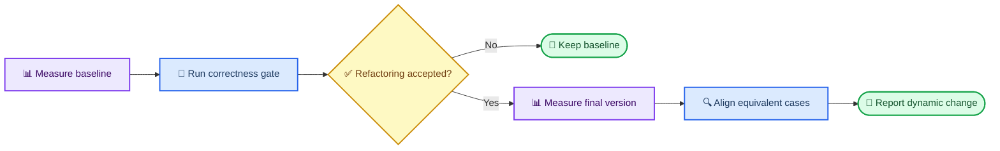

# Dynamic benchmark extension plan

_Implemented dynamic-benchmark policy for the experiment, updated 2026-08-31._

---

## 📋 Decision and current boundary

This document records the implemented optional extension. Benchmark execution
and parsing run only after the regular static, build, and correctness phases.
`off` preserves static-only behavior; `observe` records results without
affecting acceptance; `enforce` fail-closes unavailable/non-comparable results
and includes the relative dynamic penalty in acceptance.

The current merge gate continues to establish functional correctness with the
repository-native build and test commands:

| Profile | Build scope | Correctness-test scope |
| ------- | ----------- | ---------------------- |
| `ferretdb` | All Go packages with race instrumentation | All Go packages using the short test suite |
| `mongodb-query` | `//src/mongo/db/query/...` | `//src/mongo/db/query/...` |

A candidate can merge only after its static penalty decreases, its real build
succeeds, and its current correctness tests pass. Performance benchmarks will
remain a separate experimental measurement in the first implementation.

> 📌 **Current rule:** Keep benchmarks separate from correctness validation.
> Dynamic collection runs only through the opt-in merge-gate phase and selects
> no targets outside the locked production profile scope.

## 🎯 Experiment objective

The extension will measure whether an accepted refactoring changes runtime
performance. It will not use benchmark success as evidence of functional
correctness and will not interpret a single post-refactoring measurement as an
improvement.



## ⚙️ MongoDB query implementation outline

The first extension target is MongoDB query. Its source procedure is the
[local MongoDB query performance guide](../../dev/mongodb_query_performance_local_guide.md).

1. Discover `BUILD.bazel` files under `src/mongo/db/query` at runtime and
   confirm the approved native target is present
2. Build `//src/mongo/db/query:canonical_query_bm` independently and preserve
   its build log
3. Run a non-parsed one-repetition warm-up
4. Run the formal measurement with at least two repetitions and Google
   Benchmark JSON (the default is seven)
5. Store the initial baseline outside the target checkout, then store one
   candidate measurement per gate attempt
6. Parse raw JSON into a normalized JSON summary
7. Compare the candidate with the current rolling baseline; after an accepted
   fast-forward, promote that candidate artifact to the next baseline

The intended formal invocation is:

```bash
benchmark_binary \
  --benchmark_repetitions=7 \
  --benchmark_report_aggregates_only=true \
  --benchmark_out=result.json \
  --benchmark_out_format=json
```

Do not use `--benchmark_dry_run`; the checked local MongoDB benchmark binaries
may reject it. Debug builds may validate the pipeline, but final performance
claims require an equivalent optimized build on both sides.

## 📊 Data contract

Every normalized benchmark row should preserve enough identity to prevent
unrelated workloads from being averaged together.

| Group | Required fields |
| ----- | --------------- |
| Provenance | commit, run ID, profile, target, executable, build type |
| Environment | host, date, CPU count, CPU scaling state, load average |
| Case identity | benchmark name, run name, aggregate name, threads, workload label |
| Measurements | aggregate-mean real time over seven repetitions, time unit, iterations |
| Query labels | query settings count, query size, query class, hit/miss, byte size |

The MongoDB derived metrics are:

```text
latency_ratio = candidate_mean_real_time / rolling_baseline_mean_real_time
relative_change_pct = (candidate / rolling_baseline - 1) * 100
coefficient_of_variation = stddev / mean
```

Report median and mean latency, median and mean CPU time, variability,
thread-scaling behavior, and large-workload results. Never reduce all benchmark
cases to one unstratified average.

## 🔒 Comparability controls

Baseline and final rows may be compared only when all of these fields match:

- Benchmark target and run name
- Aggregate name
- Thread count
- Workload label
- Build type and build flags
- Machine and relevant environment configuration

Run the two versions under comparable machine load, record warm-up policy and
cache state, and retain the raw JSON. A missing or mismatched counterpart must
be reported as unmatched rather than silently discarded.

## 📦 Planned artifacts

Benchmark output should live in the run results tree, not in either target
checkout:

```text
production_runs/mongodb-query/results/<run_id>/benchmarks/
├── manifest.json
├── baseline/
│   ├── build_logs/
│   ├── run_logs/
│   └── run_json/
├── final/
│   ├── build_logs/
│   ├── run_logs/
│   └── run_json/
└── summaries/
    ├── normalized_results.csv
    ├── comparison.json
    └── comparison.md
```

`run_summary.json` may later reference the comparison artifact and aggregate
counts, but raw benchmark events should remain in their dedicated files.

## ✍️ Activation checklist

- [ ] Confirm the research question and whether performance is observational or
  a merge criterion
- [ ] Inventory the current MongoDB query benchmark targets dynamically
- [ ] Select and document optimized build settings
- [ ] Define warm-up, repetition, cache, and machine-load controls
- [ ] Implement raw artifact collection outside the target checkout
- [ ] Implement strict case alignment and unmatched-case reporting
- [ ] Add parser and comparison regression tests using fixed JSON fixtures
- [ ] Run one baseline/final smoke comparison before any large experiment
- [ ] Review measurement overhead before enabling repeated execution
- [ ] Update the thesis method and threats-to-validity text before interpreting
  performance results

Until every required item is complete, the current functional build/test gate
remains the only dynamic execution stage in production runs.
